# December 2024
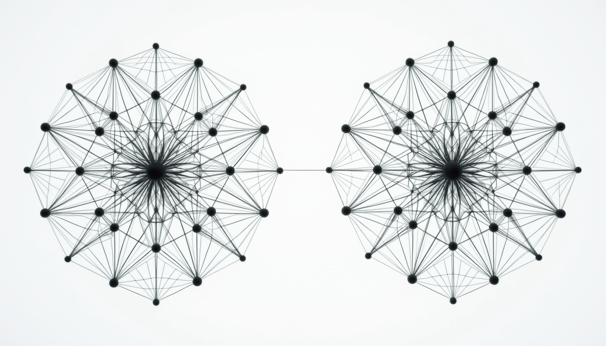

*The connections between compute nodes within a datacentre can have very high bandwidths and connectivity, but scaling beyond a single building cannot be as simple as connecting two core switches across a few hundred meters.*

**This month's updates:**

* Amazon's Trainium2 AI accelerator generally available, plans a 400K chip ultra-cluster "Rainier"
* Nvidia's B300 GPU – limited release of specs ahead of official announcement at GTC 2025
* Google's 6th gen TPUs, named "Trillium" now generally available on GCP
* Nvidia presents its vision for future AI accelerators using silicon photonics and 3D stacking
* Google and IBM make breakthroughs in quantum computing, on opposite ends of HPC

**One-pagers:**

* SSDs
* Optical fibre
* SRAM

* * *

# This month's updates:

## Amazon's Trainium2 and "Project Rainier"

_At their annual Re:Invent conference, AWS made two major announcements regarding developments in custom silicon: the general availability (GA) of the Trainium2 AI training accelerator, and the 400,000 chip "ultra-cluster" named project Rainier._

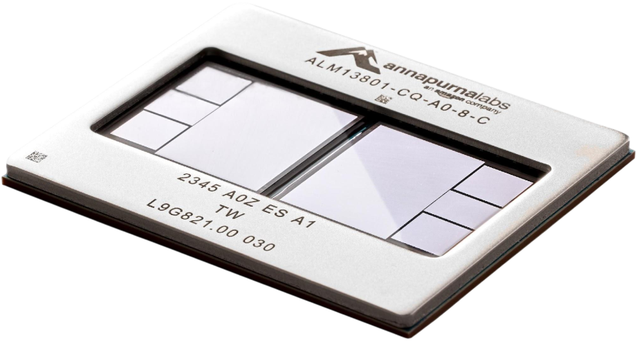

*Source: Amazon*

AWS recently announced GA for instances containing Trainium2 (Trn2) accelerators, the latest chip in its custom silicon lineup. Benchmarks for Trn2 instances aren't available yet, but the release notes state that the smaller SKU - a 16-chip, 9 x 2 RU (inc. a 2 RU Intel sapphire rapids CPU chassis), half-rack product - will provide ~20 PFLOPS at FP8 and 1.5 TB of on-chip memory (96 GB HBM3 per chip). This SKU will have ~8 TB/s scale-up and ~12.8 Tb/s scale-out (note the bytes vs bits conventions in the units) aggregate bandwidth, and these networks will be carried by AWS's own NeuronLink chip-to-chip and Elastic fabric adapter (EFA) ethernet stack, respectively.

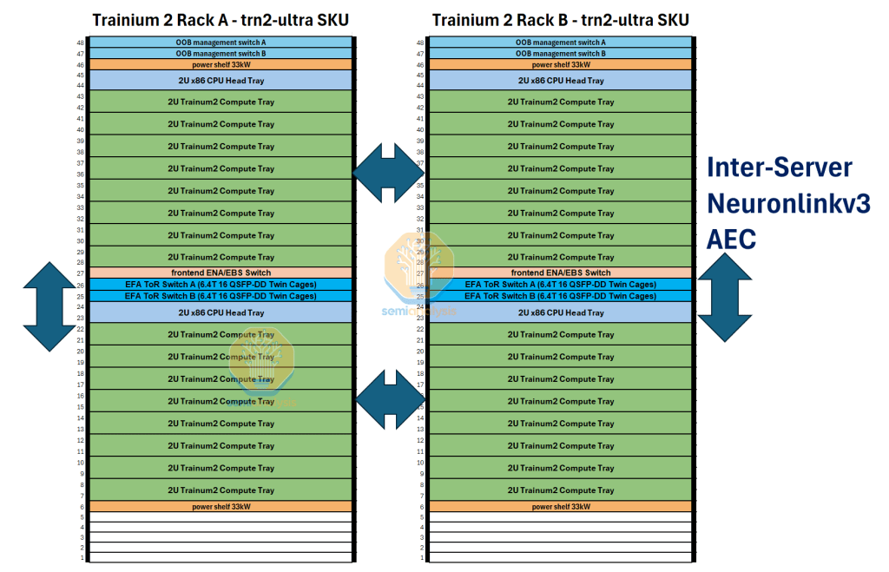

*Source: SemiAnalysis*

AWS also revealed plans for the upcoming project "Rainier", a 400,000 x Trn2 "ultra-cluster" spread over multiple datacentres and connected by their elastic fabric adapter (EFA) networking stack. AWS states that Rainier is designed for use by AI foundation model lab Anthropic, which AWS recently funded with $4B - a large proportion of which is likely to be in cloud credits - to provide up to 5x more compute than was used to train their current leading models. It's likely that Rainier will compromise of 6,250 Trn2 Ultra SKUs - the 64-chip + copper backplane, twin-rack product - resulting in Anthropic likely having to make some changes to their current model training methods which have been optimised for 8 x Nvidia H100 GPU servers.

It will soon become clear whether the main challenge faced by users will be optimising training for this less arithmetically intense hardware, or distributing their AI models for inferencing on these new scale-up architectures.

## Nvidia's B300 early specs

_Just before Christmas, Nvidia released specs for its upcoming B300 AI GPUs. Previously known as the B200 Ultra, the B300 is expected to be officially announced at GTC 2025 along with (hopefully) solutions to the supply chain and overheating issues that have affected the Blackwell architecture so far._

Through communications with UDN and SemiAnalysis, Nvidia has released early specs for its upcoming B300 AI GPU, revealing a product competitive with AMD's plans for its MI325X and MI355X GPUs. It's estimated currently that the B300s will be available on the market in 4Q2025, but it's unclear who the major customers will be given that large orders for B200/GB200 systems have already been placed by xAI and Microsoft, among many others.

On the system specs, it's been revealed that the TDP of the B300 will be at 1200W, compared to the 1000W of the B200, but information on the exact effect this has on an 8-way GPU server's TDP will come from OEMs such as Dell and Lenovo. In addition, the OEMs will have more control over repairs and maintenance going forward as Nvidia is moving from existing SXM board designs to "SXM puck" designs which allows for more flexibility in board design and chip replacement.

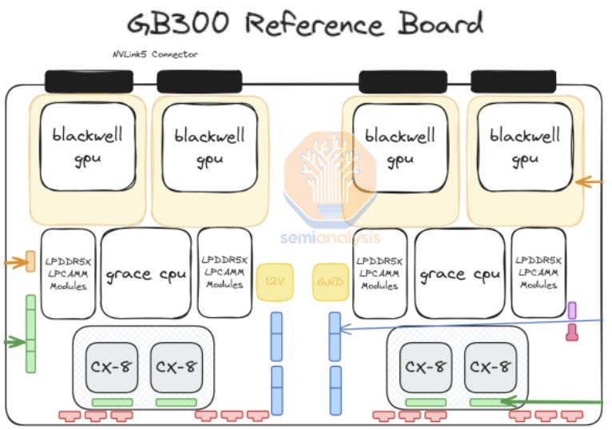

*Source: SemiAnalysis*

As for chip specs, the B300 GPU die will be taped out with TSMCs 4NP process node and deliver 1.5x the FP4 FLOPs compared to the B200. It should be noted that FP4 formats are not used for training and are rarely used for inference, so how useful this statistic is for assessing the compute capability of the chip is debatable. The HBM will be upgraded from 192 GB in 8-Hi to 288 GB in 12-Hi, though it's still HBM3e with the same number of modules, so the aggregate bandwidth remains the same at ~8 TB/s. SK-Hynix will be the primary supplier of this, as Samsung is still failing validation of its HBM3e products due to thermal and power issues. Regarding NVSwitches, the B200 HGX boards feature two NVSwitch gen. 5 modules and its likely the B300 will do the same, but the GB300 board (just like the GB200) will have separate dedicated NVSwitch trays to enable the ultra-dense NVL72 rack SKUs. It should also be noted that CX8 NICs will be available with double the bandwidth but also 1.5x the PCIe lanes.

## Google "Trillium" TPUs now generally available

_Google firmly holds onto its lead as the world's top designer and producer of custom silicon. The latest in its tensor processing unit (TPU) lineup, the TPUv6, demonstrates further efficiency and performance gains on its predecessors after being announced as generally available (GA) on Google cloud platform._

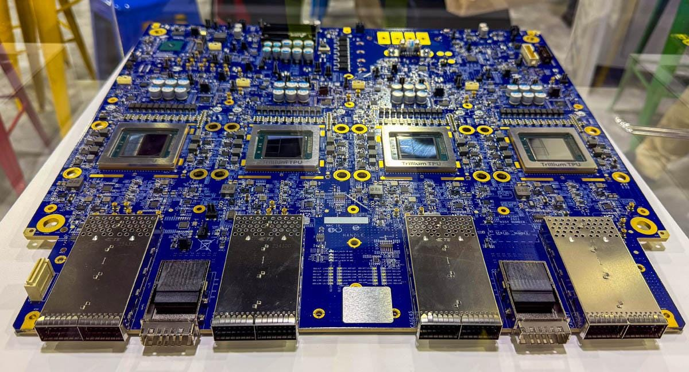

*Source: Google*

Google has announced GA for its TPU v6e - or "Trillium" - generation of AI accelerator instances on GCP cloud services. TPUs have long been a popular choice for enterprises with it having been speculated that Apple's AI (Apple intelligence), Anthropic's Claude 2 series, and Google's own Gemini models have all been trained on TPUs.

Improving on the TPUv5e by increasing the total compute capacity from ~200 to ~900 TFLOPs at BF16, the v6e also provides double the compute available in the more performant v5p TPU. Google has therefore set the precedent that the "e" (efficiency) variants will now compete with past generations' "p" (performance) variants. As for memory, v6e provides 32 GB of HBM per chip at a bandwidth of ~1.6 TB/s, doubling the specs for v5e but not improving on the v5p. Whilst its not made clear which generation of HBM is in use here, its very likely based on the specs that the memory system is implemented as two stacks of HBM3.

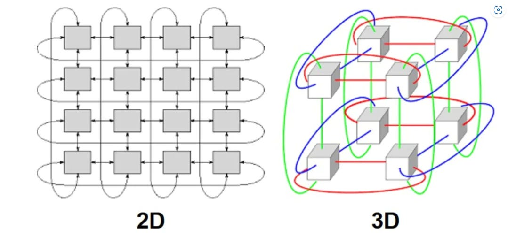

*Source: Wikipedia*

Going beyond a single device, the v6e provides of ~3.6 Tb/s of chip-chip bandwidth over 4 ICI ports - Google's proprietary "inter-chip-interconnect" technology - compared to v5e at ~1.6 Tb/s over 4 ports and v5p at 4.8 Tb/s over possibly 6 ports (v5p full specs are not publicly available). As expected, Google also scaled the host server which TPU servers are attached to, providing up to 3x the DRAM and 4x the host-host interconnect bandwidth. Finally, the topology of a multi-chip v6e instance is confirmed to be a 2D torus, just as with the v5e, compared to the 3D torus topology of the v5p instances.

## Nvidia's plans for silicon photonics

_As bandwidth requirements between chips increase faster than existing copper-based interconnects can keep up with, many chip design teams are looking to other technologies for future-proofing their roadmaps. Nvidia has taken centre stage by showing early plans for photonics-enabled GPUs._

At IEDM24, Nvidia and TSMC jointly announced their plans for overcoming the chip-chip bandwidth wall – integrated silicon photonics. Typically chip-chip communications require traces (wires) etched into the silicon of the chip itself connecting memory and interconnect interfaces. More modern techniques involve putting these memory and interface chips onto a common silicon interposer layer (2.5D) for enhanced connectivity or stacking these layers vertically (3D) for even closer integration. But all these methods are still limited by one material: Copper.

Copper interconnects and the technology supporting them have progressed to allow for incredibly dense and high-bandwidth connections between multiple chips on motherboard, but metal will always have fundamental limitations such as signal loss, electrical resistance, and interference. Optical fibres overcome many of these limitations but only recently have optical interface layers between chips themselves become a viable option.

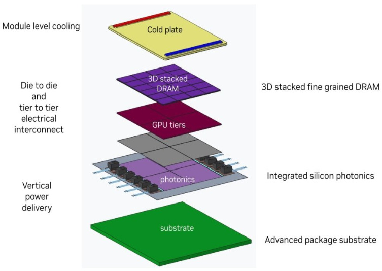

*Source: Nvidia*

Nvidia's prototype design involves using 3D vertical stacking of multiple GPU and DRAM layers on top of a photonics interconnect layer, which will contain multiple interfaces between electrical and optical domains.

Industry analysts predict this technology will present in the market from 2028-2030, and at Nvidia's current release rate, 3-5 generations of Nvidia's AI GPUs will be released before the final version of this prototype. Currently, the design involves 12 integrated photonics modules allocated to each "GPU tier" which will be made of 4 individual GPU tiles, each connected to 6 DRAM tiles. However, as the design is still in its early stages and the silicon photonics interfaces will become even denser as the technology advances, its possible we may see an entirely different product at the next announcement.

## Google and IBM in the race to quantum supremacy

_Both Google and IBM - the two leaders in the race to quantum supremacy - end this year with announcements of significant progress in quantum computing hardware. Whilst Google shows progress in chip-making, IBM leads in networking._

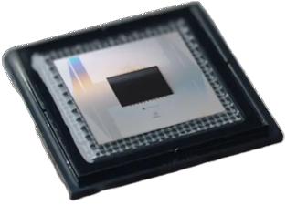

*Source: Google*

HPC scales in two dimensions: individual chip capability, and chip-to-chip networking speed. Addressing the former, Google announced a major milestone towards viable quantum supremacy using their Willow quantum compute chip. Whilst the workload they ran (random circuit sampling) in record time using the chip was not technically impressive, the technology that enabled everything was. For the first time, a quantum compute chip could correct errors faster than they appeared, and the error correction capability increases exponentially with the size of the chip.

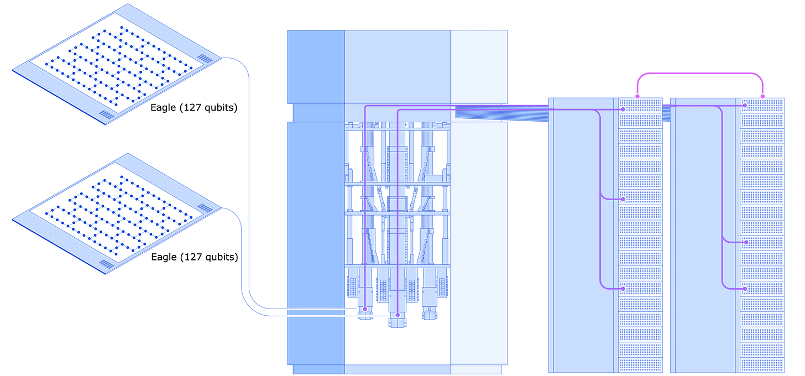

*Source: IBM*

IBM, not to be left behind, announced their progress towards the second dimension of scaling HPC: Quantum chip-to-chip networking. Realising that future quantum workloads will inevitably scale beyond a single chip, IBM demonstrated two chips simulating a distributed quantum workload over a classical network. Combining the compute capability of two of their Eagle quantum processing units (QPUs), they were able to effectively create a quantum state that could not fit onto a single chip on its own, and coherently connect it without increasing the error rates to an unacceptable level.

Whilst there is less detail available on how quantum computing and hardware works, this publication hopes to raise awareness on the significance of these achievements.

* * *

# One-pagers:

## SSDs

_Solid state drives (SSDs) are one of the two common devices used in datacentres to persist data even without power. Traditionally, hard disk drives (HDDs) with magnetic disks and sensors were used but with SSDs, data read and write speeds are no longer limited by mechanics._

In modern datacentres the majority of "cold" - infrequently accessed or archived - data is stored in HDDs. SSDs, however, are used for all other cases: when data has just been written, needs to be read, or needs to be available as quickly as possible with demand. SSDs therefore need to be manufactured in very specialised foundries, using similar technology to chip manufacturing.

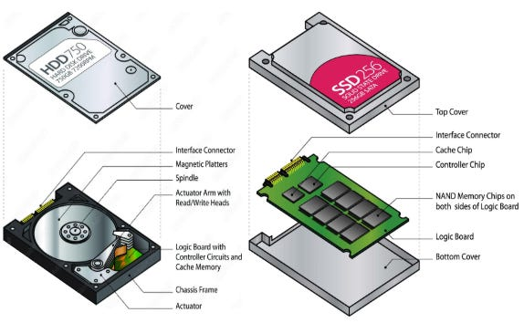

*Sources: University of Waterloo, Jimi2mall*

SSDs physically store information in cells, which are transistors that store electrical charge of various amounts. Depending on design, these cells can be single level cells (SLC), multi-level, or triple and quad level. Each successive cell design stores (for the purpose of this explanation) the same volume of charge but distinguishes the exact amount of charge more precisely, allowing the charge level to be "classified" into one of a greater number of levels.

*Source: Kingston technology*

More information-dense cells lead to higher capacity SSDs, but also faster deterioration, as damage to the cell over repeated use manifests itself sooner if the cell must be able to store and provide more precise charge levels. For this reason, modern storage servers contain a mixture of QLC/TLC and SLC SSDs, managed by storage software that handles data reading/writing efficiently.

## Optical fibre

_Hollow glass fibres that approach the width of the thinnest naturally occurring strands in existence are now mass manufactured and deployed across the world. For carrying multiple, high bandwidth signals reliably over distances long enough to connect racks across a datacentre, optical fibres are the only reasonable option._

Modern optical fibres range in thickness from ~63 to ~8µm. At these scales, the diffraction (spread) of light being transmitted within the glass is less than the magnitude of the waveguide effect, or the "narrowing" effect that the total internal reflection (TIR) has on the light. Single-mode fibres are thinner - around 8-9 µm - and only allow for a single mode (path) for the light to internally reflect along. This allows for very long-distance transmission without significant signal degradation. Multi-mode fibres - 50-63 µm - are too thick to restrict light to a single mode, leading to greater signal loss, but are cheaper and easier to produce.

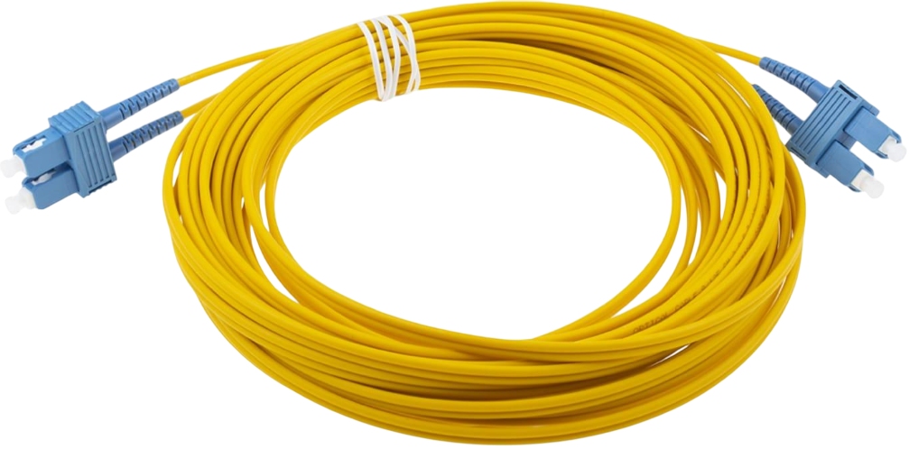

*Source: RS*

To connect network interfaces via fibre, transceivers are used to convert electrical signals to optical signals. Transceivers therefore require non-trivial amounts of power and add latency to the signalling process, but the increased efficiency and speed over using copper make optical connections cost-effective for most applications.

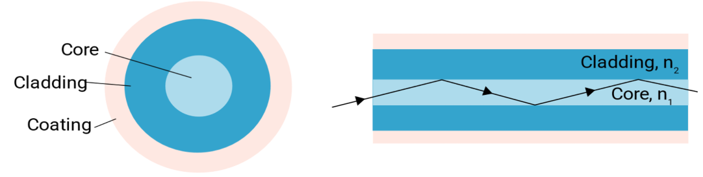

*Source: MeetOptics*

To send multiple signals over a single fibre, different signal sources are assigned different wavelengths (colours) of light, and devices called multiplexers combine these various signals into one. This new signal, carried by a single beam of light, can be sent across long distances using single-mode (thinner) fibres without incurring significant amounts of degradation. On the end, a device called a demultiplexer then disaggregates this signal into the original set of unique signals at their differing wavelengths. This process is called wave-division multiplexing, or WDM, and is key to reaching bandwidths high enough to enable modern communications technologies.

## SRAM

_Static random-access memory (SRAM) is the opposite end of the cost vs performance trade-off to DRAM. Where DRAM can be hosted in large volumes off-chip in DIMMs, SRAM is kept on chip and provides compute with the extremely low latency memory access it needs._

For on device memory (not long-term storage) there are two options available to chip designers: static or dynamic RAM. DRAM is often seen in two forms on a CPU/AI accelerator board. Either in discrete pluggable modules called DIMMs which connect to sockets - common for CPU boards - or directly soldered onto the board - common for some types of AI accelerators. SRAM however is optimised for being on the compute chips themselves.

While DRAM uses a capacitor-transistor pair to store a bit of memory, SRAM uses 6 transistors, hence taking up significantly more area per bit of memory stored. In addition, SRAM requires constant power supply to hold information, whereas information in DRAM can persist for short periods of time. However, these capacitors are also slow to charge (write) and discharge (read) and require periodic refreshing due to charge leakage from the capacitor. These processes result in SRAM having significantly higher read and write performance than SRAM, to the order of being 10-100x better.

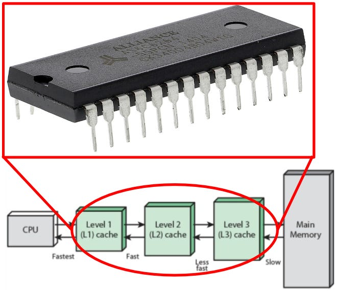

Due to its cost, power demand, and relatively low-density, SRAM is practically restricted to small volumes very near the compute or I/O resources on chip, acting as caches and buffers for fast local memory reads and writes. SRAM makes up all physical cache levels in CPUs and physical buffers in switches and NICs, as well small amounts of local memory on peripheral devices. For some specialised AI accelerators, SRAM is used as the main memory, with multiple sparse compute units being attached to their own small SRAM volumes. Such paradigms of computing are called "near-memory" or (perhaps wrongly) "in-memory" compute.