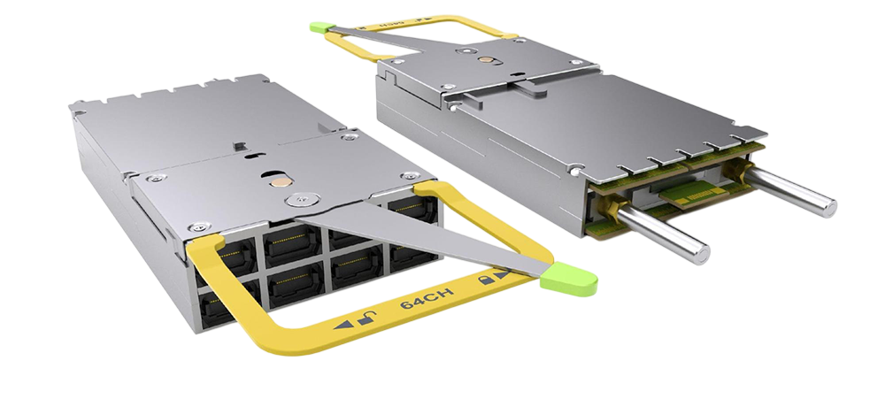
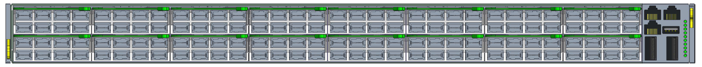
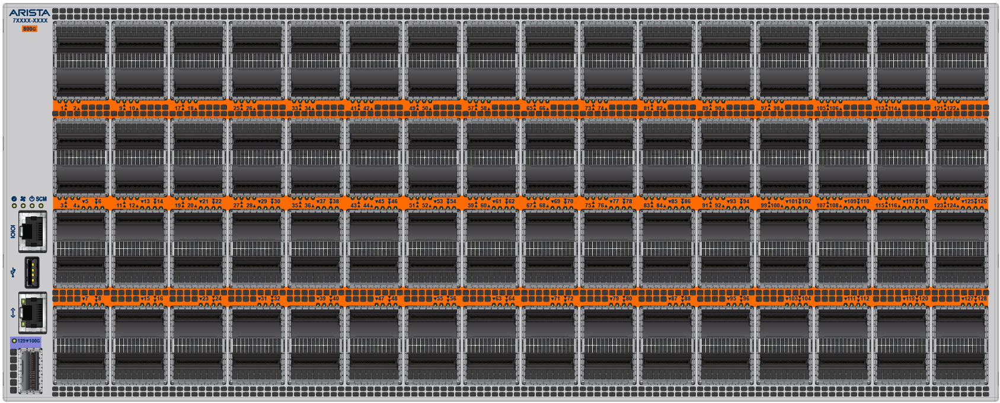

# Everything always happens all at once

This is the SixRackUnits AI hardware newsletter, keeping you up to date with the latest in AI hardware, datacentre technology, and the future of compute. With a field changing this fast, staying on top of everything, or even summarising all the material available can be difficult - so I do it for you.

For a space to share sources and news/updates, join the [telegram channel](https://t.me/aihpc_infra_fans) or if you like short form posts on similar topics, check out the [notes section](https://sixrackunits.substack.com/notes) of this newsletter or my [LinkedIn](https://www.linkedin.com/in/hitesh-kumar-6ru).

**[This month's updates](#this-months-updates)**

- [**Meta's very real, reliable roadmap revealed**](#metas-very-real-reliable-roadmap-revealed)
- [**Arista's XPO: 100s of liquid-cooled TB/s per rack unit**](#aristas-xpo-100s-of-liquid-cooled-tbs-per-rack-unit)
- [**Huawei catching up in China, NVIDIA has enemies both home and away now**](#huawei-catching-up-in-china-nvidia-has-enemies-both-home-and-away-now)
- [**Other notable headlines**](#other-notable-headlines)

---

# This month's updates

## Meta's very real, reliable roadmap revealed

*Source: Meta*

**Meta finally lays out a strong roadmap for at least four iterations of its internal-use MTIA AI accelerator, promising serious raw performance on paper as well as a solid understanding of what's needed for rapid and widespread adoption among their developers.**

It's more than just a trend now for everyone to design their own custom hardware. If you have the money, people, and consistent internal demand for specific workloads, why not? As we've seen in the past though (Intel's Gaudi), roadmaps can be fragile and are not a commitment. Meta's situation is different fortunately, since they have:

- Extensive experience deploying AI-focused clusters reliably, at scale, customising deployments to their benefit
- Two generations of MTIA already proven with a silicon-to-rack supply chain established
- No pressure to make hardware for external users, plenty of internal demand to saturate what they build

Proof of their wisdom is that all the future MTIA generations they've announced will be designed to sit in the same chassis and racks, so they can easily upgrade existing deployments rather than having to build new racks and power/cooling architectures each time. This will make it easier for them to stick to their promised 6-month cadence, potentially outpacing every hyperscaler and most merchant silicon vendors too.

If you're hands on in the datacentre or even invovled in maintenance and upgrade operations in any capacity, this should excite you. If it doesn't, then think about what it would be like if your job was just to simply pull out servers from racks, replace a few cards or just a board, and plug everything back in just as it was.

Or perhaps if you're responsible for any financials around multi-megawatt datacentres running such accelerators, what if the upgrade process invovled just buying the latest boards (not servers or racks) and having the upgrade process take days rather than weeks. No need for expensive and disruptive retrofits to the power and cooling systems facility wide.

*Source: Meta*

Meta are very clear that MTIA will not replace their GPU fleet - training workloads still need NVIDIA hardware to be run effectively, and undoubtedly some inference will still be done across the many generations of GPUs that Meta operate efficiently. But unlike many in the custom silicon game, they aren't pushing to support general-purpose training or branching their roadmap into workload-specific lanes. Instead, from MTIA 450 onwards, Meta are pushing for supporting modern LLM inference efficiently first, and then optimising for their own ranking/recommender models later.

The hardware looks great so far, but we've seen many times that the robustness and capability of the software can completely define the future of an accelerator too. Here, Meta are arguably one of the best positioned in the industry as founding members of the PyTorch foundation and now among the world's largest users of vLLM and Triton. In addition, they've written extensively on their own networking and observability stacks (FBOSS, NCCLX, Dynolog etc.) and how they can optimise both NVIDIA and their own hardware for their use cases.

The specs we know so far:

*Source: Meta*

- MTIA 300
  - In production now, already deployed at meaningful scale for Meta's own workloads
  - 1 compute, 2 network chiplets
  - ~1.2 PFLOPS FP8, 216GB HBM @ 6.1 TB/s, 800W TDP
  - 1TB/s scale-up unidirectional, 1.6T scale-out
  - **16-device scale-up domain**

*Source: Meta*

- MTIA 400
  - Deployment underway, framed as genuinely performance-competitive
  - 2 compute, 2 network, 1 SoC chiplets
  - ~6 PFLOPS FP8, 288GB HBM @ 9.2 TB/s, 1200W TDP
  - 1.2TB/s scale-up unidirectional, 800G scale-out
  - **72-device scale-up domain, in one rack, switched backplane**

*Source: Meta*

- MTIA 450
  - Due early 2027, tuned directly for LLM inference
  - 2 compute, 2 network, 1 SoC chiplets
  - ~7 PFLOPS FP8, 288GB HBM @ 18.4 TB/s, 1400W TDP
  - 1.2TB/s scale-up unidirectional, 800G scale-out
  - **Doubling die-to-die interconnects from MTIA 400**

*Source: Meta*

- MTIA 500
  - Due late 2027, the most modular and most ambitious
  - 4 compute, 2 network, 1 SoC chiplets
  - ~10 PFLOPS FP8, 384-512GB HBM, 1700W TDP
  - 1.2TB/s scale-up unidirectional, 800G scale-out
  - **2x2 compute chiplet arrangement**

## Arista's XPO: 100s of liquid-cooled TB/s per rack unit

**Arista showcases an incredibly dense 12.8T pluggable optical transceiver. Coming with integrated liquid cooling, and designed for an already mature supply chain and manufacturing base, Arista are placing their bets on availability and serviceability being the real deciding factors for buyers.**

*Source: Arista*

"eXtra-dense Pluggable Optics", or XPO, is a new optical pluggable form factor showcased publicly earlier this month at the Optical Fibre Communications conference. Currently SFP - small form-factor pluggables - are used for converting between the optical and electrical domains, allowing long-range signals carried through optical fibres to be converted and then passed into server chassis and into chips.

Datacenters everywhere contain multiple types of such pluggables. These range from small 10G SFPs designed for carrying multi-kilometer signals, to large 1600G "Octal" OSFPs that carry 160X that bandwidth over as little as 30 meters. Given the number of such modules already deployed and the volume being manufactured for replacement and new builds, it seems that no matter what new technologies come out, optics are here to stay for a while.

Even with NVIDIA (and earlier, Broadcom) wanting to aggressively push their Co-Packaged Optics (CPO) switches into mass adoption, the demand for optics appears to just keep growing. Regardless of the bandwidth demands of the latest accelerators and workloads, hardware vendors must let the inertia of the industry carry them along, or risk getting left behind before the market is ready for their revolutionary but as of yet narrowly supported new technologies.

This is where Arista's experience and foresight show; XPOs are still field replaceable pluggables, use mostly the same supply chain and manufacturing base as existing pluggables, and come with a roadmap backed by multiple industry leaders. In comparison, difficult to manufacture CPO products or relatively untested optical switching technologies are very high risk in the long term for investors and deployers.

XPO modules are indeed "eXtra-dense" as made clear at the conference by the demos from various contributors to the XPO MSA (multi-source agreement) like TeraHop, Amphenol, and Molex to name just three. These take eight MPO-16 cables each carrying eight 200G lanes, for a total of 64 x 200G lanes per module. 64 lanes both in optical and electrical, hence gearbox chips aren't needed either like they might in some smaller transceivers.

The current spec reaches 12.8T per module whilst taking up just a quarter as much area on the front panel of a switch. This means each switch now only needs to be a quarter the height now, and racks can be four times as dense in bandwidth. It's unclear if this will be practical for real, large deployments as cabling is already an issue for very dense setups like backend fabrics in AI clusters. But clean cabling is a much easier problem to solve than density and power.

*Source: Arista*

Granted, these modules now need to be liquid cooled and that too with a fairly complex system that needs an inlet/outlet pair per module, not just per switch. But compared to cooling optics by air, Arista says temperatures across various components could be kept up to 25 deg. C lower, making performance consistent and extending the lifespan of parts. Arista states that this same design could cool up to 400W worth of generated heat from the module. This could support future communications specifications like carrying bandwidths as high as 3.2T over ranges as far as 80KM (ZR).

*Source: Fouriers cat on WeChat. We see here the two 32-lane "paddle" boards sandwiching the cold plate. To reduce crosstalk between this many high-bandwidth lanes in a board, the transmit (Tx) and receive (Rx) signals are split and routed to opposite sides of the paddle boards. The power supply and communications are on the same board that plugs into the switch port.*

For power delivery, these devices now can take 50VDC from the rack bus bar and then internally step down to 3.3V, which is what SFPs use. This means to reach the same wattage at higher bandwidths and ranges, the current supplied can be a lot lower and hence the internal power architecture a lot lighter.

The XPO MSA (Multi-Source Agreement) itself hasn't published a list of their members yet, but from Arista's announcement we know there are 45 so far. From what we can see, its most prominent confirmed members include Arista, Marvell, Foxconn and Coherent just to name a few. It's entirely likely that names like Broadcom and TSMC may join though both have existing stake in competing CPO technologies.

## Huawei catching up in China, NVIDIA has enemies both home and away now

**Huawei has made significant progress towards becoming China's default domestic AI accelerator stack. They probably won't beat NVIDIA on silicon anytime soon, but they're finally starting to break down the real walls to adoption: software compatibility and system-level design.**

It can't be an easy realisation to have, that your software stack has to be compatible with someone else's just to gain traction in any market. But now that Huawei have made strides in mapping their CANN (Compute Architecture for Neural Networks) stack to something a CUDA developer would recognise, they seemed to have piqued the interest of domestic hyperscalers even.

CANN is Huawei's core software stack for their Ascend AI accelerators - the compiler, runtime, operator libraries, tooling, and framework integration layer that sits between models and the hardware. Specifcally, "CANN Next" now supports a CUDA-like model with thread blocks, and warps, `<<>>` style invocation, PyTorch and vLLM compatibility, and more. This isn't just a translation layer it seems. Huawei has reportedly open-sourced key components such as CANN and their inferencing engine MindIE, as well as contributing to over 50 third-party open-source projects since the Ascend program started (albeit many years ago). Just like NVIDIA, they are trying to show a long-term commitment to widening their developer base through collaboration.

Their silicon itself might not be competitive on the global scale, but Huawei has proven to be quite forward thinking with their strategy. Almost at the same time as NVIDIA, in September of 2025, Huawei announced a split roadmap for the Ascend 950 series, with separate chips for LLM prefill and decode workloads. The Rubin CPX was originally intended to be NVIDIA's prefill processor with it's GDDR7 lower speed and better compute:memory bandwidth ratio and when it was announced, a lot of analysts and engineers understood the importance of this.

Huawei, along with a very small number of other AI accelerator manufacturers like Google, had also reacted to the need for this hardware-to-workload mapping and split, showing a good understanding of the industry and the future. The Ascend 950PR (1Q26) and 950DT (4Q26) were originally intended to provide 128GB @ 1.6TB/s and 144GB @ 4TB/s respectively, a very similar performance split to Rubin CPX and R200 GPUs.

But the realised performance of the 950PR half a year later tells a new story. Reporting at 112GB @ 1.4TB/s, the unacknowledged reduction in performance speaks to difficulties somewhere in the memory supply chain. This is consistent with the current state of memory making in China where restrictions on the import of advanced manufacturing technologies  

- CANN Next appears to be the key change. Huawei has added a CUDA-like SIMT programming model with thread blocks, warps, and kernel launches.
- Important nuance: this does not look like a simple translation layer. Huawei seems to be treating CUDA as the de facto programming standard, then mapping those abstractions natively onto Ascend.
- The software opening has been building for a while. In 2025 Huawei moved to open-source key Ascend stack components including CANN, GE, Ascend C, and MindIE.
- Huawei also says CANN now supports or works with PyTorch, vLLM, SGLang, xLLM, verl, Triton, and TileLang. Whether that support is deep enough in practice is a separate question, but the direction is obvious.
- The March CANN slides are arguably even more important than the chip slides. Huawei is not just exposing APIs, it is showing an actual developer workflow around Ascend C.
- The tooling shown includes a VS Code plugin, MindStudio Insight, `msDebug`, `msSanitizer`, `msProf`, and operator engineering tools around `msopgen/msopst`.
- That matters because a CUDA competitor needs debuggers, sanitizers, profilers, visualisation, and build tooling, not just kernels and marketing.
- Huawei is also explicitly supporting heterogeneous compilation and direct `<<<>>>` style invocation semantics, which is about reducing mental friction for CUDA-trained developers.
- The slides describe the next-generation Ascend C model as mixed `SIMD/SIMT`, not one replacing the other. That suggests Huawei wants vector efficiency and GPU-like programmability at the same time.
- A useful comparison with the older Ascend stack: Huawei's 2021 PyTorch operator development docs were framed around `TBE operator development` and `operator adaptation to the PyTorch framework`, which is a much less direct attack on CUDA than exposing GPU-like execution semantics outright.
- In those same older docs, the assumption was effectively "develop or adapt the operators Huawei needs", not "take a CUDA-trained developer and make Ascend feel familiar on day one."
- Huawei's broader 2024 Ascend software docs also still pointed developers first toward AscendCL APIs, MindX SDK, and MindStudio-based workflows, which again feels more like a proprietary stack that users must learn than a direct CUDA replacement strategy.
- Even in Huawei's own 2024 vLLM deployment guidance for Ascend, support was narrower and more bespoke: patched code packages were required and only FP16/BF16 inference was supported there, which is a long way from the current pitch around CUDA-like programmability and FP4-first inference economics.

The adoption trigger therefore looks much more like compatibility and mature systems-level design than just price or silicon performance. If Chinese customers are starting to take 950PR seriously, it is probably because Huawei is reducing migration pain across the whole stack rather than trying to win on one raw chip number. In other words, this looks less like a classic GPU launch and more like a full domestic platform offer with software, cards, interconnect, and deployment support all moving together.

- Reuters, echoed by WCCF, says Chinese customers are happier with the 950PR because it is more CUDA-compatible and has better response speeds. That sounds like the actual adoption trigger.
- So Huawei may be winning customers by reducing software pain rather than by leapfrogging NVIDIA on die-level performance.
- Export controls and Chinese policy are doing real work here. Domestic chips are increasingly preferred in state-linked procurement, while importing NVIDIA parts into China is slow, political, and operationally messy.
- This means Huawei's momentum is not explained by the chip alone. It is the combination of sanctions, domestic policy, a more open software stack, and deep system integration.

That systems-level thinking is all over Huawei's messaging too. The company is clearly not trying to sell just a chip, but an entire domestic AI stack spanning cards, rack-scale fabrics, large cluster systems, and the surrounding software environment. This has been Huawei's strategy for a while with CloudMatrix, but now it feels much closer to being commercially usable rather than just strategically interesting.

- Huawei is clearly building a full domestic stack: Ascend silicon, self-built HBM, UnifiedBus interconnect, Atlas cards and servers, CloudMatrix / Atlas SuperPoD systems, CANN, MindIE, and open-source integrations.
- This matches Huawei's older CloudMatrix 384 strategy: accept weaker per-chip silicon, then compensate with more system engineering, more optics, and more scale.
- CloudMatrix 384 already showed this pattern with 384 Ascend 910C chips, roughly 5,400 400G transceivers, and a massive 560-600 kW system draw just to compete at the system level with NVL72.
- Huawei therefore does not need Ascend to beat NVIDIA chip-for-chip if it can win cluster-for-cluster inside China.
- Huawei has said CloudMatrix 384 deployments have exceeded 300 units across more than 20 customers. If true, that is enough installed base to start creating ecosystem gravity by itself.
- Atlas 950 SuperPoD made its first global appearance at MWC Barcelona 2026. Huawei says it can scale to 8,192 NPUs, with 64 NPUs per cabinet, all linked as one computer through UnifiedBus.
- An independent topology writeup based on Huawei's public data models Atlas 950 as 128 compute cabinets plus 32 bus cabinets, arranged in eight groups.
- That same analysis assumes 64 cards per cabinet, 16 compute cabinets plus 4 bus cabinets per group, and second-half 2026 timing.
- In the 384-node generation, Huawei reportedly used 3,168 optical fibres. Extrapolations for the 8,192-node system imply an enormous optics footprint even without a literal all-to-all fabric.
- Important systems point: Huawei's "all-optical" marketing should probably be read as "optics everywhere it matters," not a naive fully connected graph.
- Huawei is also pushing UBoE, effectively UnifiedBus over Ethernet, as a way to reduce switch and optics count versus RoCE while keeping customers inside an Ethernet-centric operating model.
- That is a clever positioning move: Huawei is not just offering "a Chinese GPU," but a domestic alternative to CUDA, NVLink/NVSwitch, rack-scale systems, and even the surrounding network architecture.

Reportedly, ByteDance and Alibaba are preparing orders for the 950PR. If true, that is probably the most important commercial signal in the whole story. It would imply not that Huawei has become globally superior to NVIDIA, but that migration friction has fallen enough for major Chinese customers to seriously commit to a local platform rather than treating it as a backup option.

- Atlas 350 is the first shipping card built around the 950PR, launched at Huawei China Partner Conference 2026 in Shenzhen.
- This looks more commercialised than some English reporting implied. At launch, Huawei showed seven hardware partners already shipping Atlas 350 based systems.
- That matters because it suggests the product was already in ecosystem rollout mode, not waiting for a distant 2H26 volume event.
- Some commentators are dismissing the 750,000 number outright because Reuters has repeatedly revised Huawei production figures upward and because launch evidence suggests deployment has already started.
- At the same time, the strongest bearish counterargument is that even 750,000 units is tiny relative to U.S. and partner output, especially once adjusted for chip quality and per-chip performance.
- That critique is directionally fair for global compute supply, but it misses the more relevant question: whether Huawei can satisfy enough domestic Chinese demand to become the default local option.
- A weaker but still interesting rumor in Chinese investor coverage is that DeepSeek V4 is prioritising adaptation to domestic compute. If true, Huawei could benefit from model-side optimisation rather than just customer-side substitution.

The split between 950PR and 950DT is also more important than it first looks. PR is aimed at prefill-heavy inference, while DT comes later for decode and more training-oriented work. Huawei had this split-workload roadmap in place well before NVIDIA made the same kind of disaggregation more visible publicly, which suggests it understood early that the next real volume wave would come from inference serving rather than one universal accelerator doing everything.

- The 950 series is already split by workload. 950PR is for prefill and recommendation-heavy inference, while 950DT comes later for decode and training-oriented tasks.
- Smart inference: Huawei is following the same prefill/decode disaggregation trend the wider AI infrastructure market is moving toward, rather than chasing one universal chip.
- Huawei roadmaped the 950PR for 1Q26, 950DT for 4Q26, 960 for 4Q27, and 970 for 4Q28. March 2026 is therefore Huawei cashing a roadmap promise, not just teasing slides.
- The architecture slide explicitly presents a unified 950 chip interface with different memory pairings: HiBL 1.0 for lower-cost PR products and HiZQ 2.0 for higher-bandwidth DT products.
- This strengthens the interpretation that 950PR and 950DT are not radically different chips, but memory- and workload-specialised products built on a common base platform.
- Another inference: 950PR looks much more like an H20 replacement than a B200 replacement. That is logical, because export controls created a huge China-only market gap exactly in that performance class.
- Another inference: Huawei is doing the sensible thing for a constrained domestic supply chain by pushing the easier memory and packaging problem first, then the harder one later.
- If HiBL 1.0 is lower-cost and lower-bandwidth than HiZQ 2.0, Huawei can prioritise a larger volume inference chip before attempting the higher-bandwidth decode/training product.
- That would also explain why some observers argue 4-layer or lower-end memory stacks are enough for a large share of current inference workloads, especially compared with training.
- Another inference: Huawei is trying to own the inference-heavy domestic deployment layer first, then move upward through DT / SuperPoD products toward larger training and mixed workloads.
- A useful hardware comparison with the older Ascend era: Huawei's long-running Atlas 300I inference cards were HHHL PCIe products built around Ascend 310 with LPDDR4X and roughly 67-72W board power, clearly aimed at efficient inference and video processing rather than directly occupying NVIDIA's high-end datacentre inference slot.
- Even the newer Atlas 300I Duo stays in that same lineage: still PCIe card form factor, still LPDDR4X, and still far closer to an edge or server add-in accelerator than a rack-scale HBM-heavy inference platform.
- On the other side, the older Ascend 910 generation was presented mainly through Atlas 800 training servers: 4U systems with eight 910 processors, 100G RoCE ports, and only three HCCS links per processor at up to 90 GB/s.
- That is important because it shows Huawei's earlier flagship hardware was much more training-shaped and much less directly targeted at the exact export-control-created gap where H20-class inference hardware now sits.
- So in hardware terms too, Huawei's older strategy was more split between small inference cards and large training boxes, whereas 950PR looks much more like a purpose-built attempt to land in the high-volume domestic inference tier.

The messier part is the specs and supply picture. Reported memory configurations, bandwidth figures, pricing, and even variant descriptions are inconsistent across Reuters, launch coverage, roadmap slides, and Chinese commentary. That could reflect reporting noise, but it could also reflect the harder reality that Huawei is still working within real domestic constraints around HBM, packaging, and interconnect. The key question is no longer whether Ascend can exist, but whether Huawei can supply enough of the right versions, at the right quality, to become the default Chinese deployment target rather than just a usable domestic substitute.

- One reason the coverage got messy: Reuters appears to describe a 950PR family with both DDR and HBM variants, but multiple China watchers think this is partly mixing PR and DT.
- Huawei Connect 2025 said 950PR would use 128 GB of self-developed HiBL 1.0 HBM at 1.6 TB/s. Atlas 350 launch coverage now says 112 GB and 1.4 TB/s.
- That discrepancy is worth noting. It could mean yield-binning, SKU segmentation, reserved memory, or that the shipping Atlas 350 card is a cut-down implementation of the full 950PR target.
- Another plausible explanation is that Reuters described two commercial variants of a prefill product stack: a cheaper DDR card and a premium HBM card, while roadmap slides describe the chip family more broadly.
- The safest conclusion is not "Reuters is wrong" but "Huawei's shipping SKU stack is broader and murkier than the public roadmap tables suggest."
- Huawei claims Atlas 350 delivers 1.56 PFLOPS of FP4, around 2.87x the H20. That comparison is imperfect because Hopper did not natively center FP4 the way Blackwell and now Huawei do.
- Separate coverage and roadmap slides also put the 950PR around 1 PFLOPS FP8 and 2 PFLOPS FP4, suggesting Huawei is heavily optimising around low-precision inference economics.
- Huawei says Atlas 350 is the only domestic Chinese inference product with FP4 support right now. That matters because FP4 is becoming the preferred way to stretch model size and cut cost/token.
- Huawei claims multimodal generation speed is up 60%, memory access granularity drops from 512B to 128B, and small-operator memory efficiency improves 4x.
- Huawei also claims doubled vector compute and 2.5x better recommendation performance, implying the chip is being tuned for practical online services, not just flashy LLM demos.
- Atlas 350 / 950PR exposes 2 TB/s of interconnect bandwidth through LingQu / UnifiedBus, around 2.5x above the 910 generation.
- Huawei says Atlas 350 cards can be used standalone or pooled in groups of four through UnifiedBus, meaning it can flex between large-model capacity pooling and lower-latency deployments.
- Atlas 350 is rated at 600W versus H20 at 400W. So even if Huawei wins on some low-precision metrics, power efficiency is not obviously where the advantage lies.
- Reported pricing is roughly RMB 111,000, or around $16,000. That suggests Huawei is not necessarily undercutting NVIDIA dramatically; availability, compatibility, and policy alignment may matter more than price.
- A separate Reuters screenshot cited RMB 50,000 for a DDR version and RMB 70,000 for an HBM version. If real, that creates a meaningful two-tier inference product strategy.
- Smart inference: a DDR version would make sense for cost-sensitive chatbot or batch inference, while an HBM version serves higher-throughput prefill and multimodal demand.
- The hardware slides also call out Cube-Vector fused paths, register-based upgrades, efficient DMA / ND-DMA style data movement, and a 128B sector cache.
- That combination suggests Huawei is tuning the architecture around lower precision kernels and memory movement efficiency, exactly where inference economics are won.
- Slide decks also show Ascend 950 moving from a previous 2-die arrangement to a 4-die split, separating compute and IO.
- More specifically, the 950 appears to use two compute dies plus two IO dies, with the IO side weakly tied to process scaling and therefore easier to evolve independently.
- That is a smart packaging move under sanctions: separate the expensive compute problem from the connectivity problem, and preserve yield where possible.
- One slide shows each IO die with 36 lanes divided into nine ports, support for x4 UB, x4 UBoE, and x16 PCIe device connectivity.
- Huawei also highlights a dedicated collective communication unit, CCU 1.0, inside the IO die. That is another sign they are optimising for cluster communication as a first-class hardware function.
- There are conflicting volume numbers in circulation. Some reporting points to 750,000 950PR chips, while other investor-style sources imply well over one million Ascend-family shipments in 2026.
- That discrepancy probably means channel chatter is mixing chip-level forecasts, family-level forecasts, and perhaps card shipments versus die shipments.
- Another smart framing from your added notes: the current boom is in inference, not frontier training. OpenClaw / agent demand means Huawei only needs to be "good enough" where the demand curve is steepest.
- Risks and counterpoints: raw per-chip performance still trails NVIDIA, power looks high, advanced packaging is still constrained by sanctions, and some Chinese demand will continue flowing to grey-market or offshore NVIDIA.
- Also, even if CANN Next feels more like CUDA now, Huawei still has to prove profiler quality, compiler stability, debugging tooling, library depth, and real-world repo compatibility at scale.
- Another risk: public reporting is still mixing card specs, chip specs, roadmap specs, and cluster specs. Any article here should be explicit about which layer each claim belongs to.
- The big article question is whether Huawei has crossed the line from "usable domestic substitute" to "default Chinese deployment target." That is the real significance of this 950PR story.

---

## Other notable headlines

[[1]](https://www.servethehome.com/broadcom-launches-taurus-bcm83640-a-3nm-400g-per-lane-optical-dsp/): Broadcom launches 400G DSPs, laying groundwork for 3.2T optics and eventually 204.8T switch fabrics.

[[2]](https://www.linkedin.com/pulse/finally-network-silicon-thinks-itself-chris-grundemann-gsk1f/): XSight unveils a programmable 12.8T switch and 800G DPU, competing on architecture rather than just port counts.

[[3]](https://www.tomshardware.com/tech-industry/semiconductors/isscc-2026-rebellions-ucie-rebel-100): Rebellions details its UCIe based Rebel100 chiplet design, one of the more serious modular accelerator efforts so far.

[[4]](https://videocardz.com/newz/nvidia-reportedly-plans-geforce-rtx-5050-with-9gb-memory-and-96-bit-bus): NVIDIA reportedly plans a 9GB RTX 5050, using 3GB GDDR7 dies to dress up the low end.

[[5]](https://www.tomshardware.com/tech-industry/optical-transceiver-achieves-up-to-25-gbps-throughput-with-ultra-low-latency-and-10km-range-taara-beam-uses-silicon-photonics-technology-device-about-as-big-as-a-shoebox): Taara's shoebox sized optical link reaches 25Gbps over distance, keeping the dream of fibre without fibre alive.

[[6]](https://wccftech.com/micron-ships-out-the-worlds-first-256gb-socamm2-modules/): Micron starts sampling 256GB SOCAMM2, pushing LPDDR further into AI server memory territory.

[[7]](https://www.guru3d.com/story/rambus-ships-hbm4e-controller-ip-rated-for-16-gbps-per-pin/): Rambus launches HBM4E controller IP at 16Gbps per pin, because memory bandwidth targets are no longer pretending.

[[8]](https://www.trendforce.com/news/2026/03/06/news-industry-weigh-825-900-%ce%bcm-hbm-thickness-for-20-high-stacks-potentially-slowing-hybrid-bonding/): HBM vendors are weighing thicker 20 high stacks, another reminder that packaging physics still sets the pace.

[[9]](https://www.reuters.com/world/china/nvidia-preparing-groq-chips-that-can-be-sold-chinese-market-sources-say-2026-03-17/): NVIDIA is reportedly preparing China compliant inference chips, because restrictions just push the competition further downstream.

[[10]](https://wccftech.com/apples-baltra-asic-cant-come-soon-enough-as-the-vast-majority-of-its-current-ai-servers-are-reportedly-rotting-on-the-shelves/): Apple reportedly has most of its AI servers sitting idle, which is not what strategic urgency looks like.

[[11]](https://www.nextplatform.com/compute/2026/02/23/amd-says-helios-racks-and-mi400-series-gpus-on-track-for-2h-2026/4092199): AMD says Helios and MI400 remain on track, though only shipped systems will settle that argument.

[[12]](https://www.nextplatform.com/compute/2025/10/14/oracle-first-in-line-for-amd-altair-mi450-gpus-helios-racks/1632443): Oracle is reportedly first for AMD's MI450 Helios racks, a major chance for AMD to prove rackscale credibility.

[[13]](https://xpu-news.hn.plus/item/178347/aws-and-cerebras-team-up-on-ai-inference): AWS and Cerebras are splitting inference between prefill and decode, showing hyperscalers will mix silicon when latency matters.

[[14]](https://www.trendforce.com/news/2026/03/04/news-socamm-war-heats-up-micron-ships-256gb-socamm2-samples-topping-industry-capacity/): TrendForce says Micron now leads SOCAMM2 capacity, turning LPDDR into another front in the AI memory war.

[[15]](https://www.tomshardware.com/pc-components/gpus/lisuan-updates-lx-professional-gpu-product-page-with-server-and-workstation-specs): Lisuan expands LX server and workstation specs, and China's domestic GPU stack keeps looking increasingly serious.

[[16]](https://www.techspot.com/news/111547-rewritable-hard-drive-made-dna-researchers-possible.html): Rewritable DNA storage remains fascinating research, but fortunately for SSD vendors, it is still nowhere near practical.

[[17]](https://www.guru3d.com/story/nvidia-dgx-station-gb300-superchip-specifications-and-748gb-unified-memory/): NVIDIA's DGX Station GB300 is absurdly powerful for a desk, which is exactly why people will want one.

[[18]](https://www.tweaktown.com/news/110499/kioxia-announces-a-brand-new-type-of-ssd-and-its-a-game-changer-for-ai/index.html): KIOXIA is building SSDs to extend effective GPU memory, because flash is becoming the fallback for scarce HBM.

[[19]](https://www.tomshardware.com/tech-industry/artificial-intelligence/amd-broadcom-and-nvidia-join-hyperscalers-to-define-optical-scale-up-interconnect-of-the-future-for-ai-clusters-meta-microsoft-and-openai-to-benefit-as-speeds-eventually-scale-to-3-2-tb-s): AMD, Broadcom and NVIDIA are standardising optical scale up links, because copper is running out of road.

[[20]](https://www.nextplatform.com/connect/2026/03/02/nvidia-sees-the-light-on-silicon-photonics-and-maybe-optical-switching/4093099): NVIDIA is betting heavily on silicon photonics, because optics is becoming mandatory rather than exotic.

[[21]](https://wccftech.com/samsung-hbm4e-memory-up-to-4-tbps-bandwidth-16-gbps-speed-48-gb-capacity/): Samsung already displays specs for HBM4E - 48GB @ 16Gbps pin rates

---

