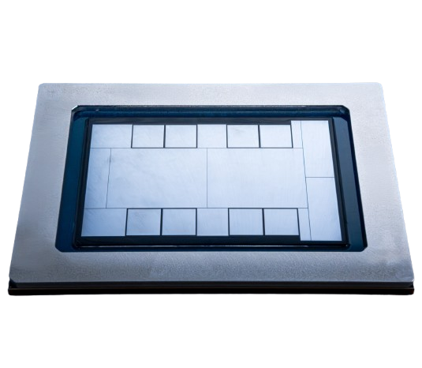
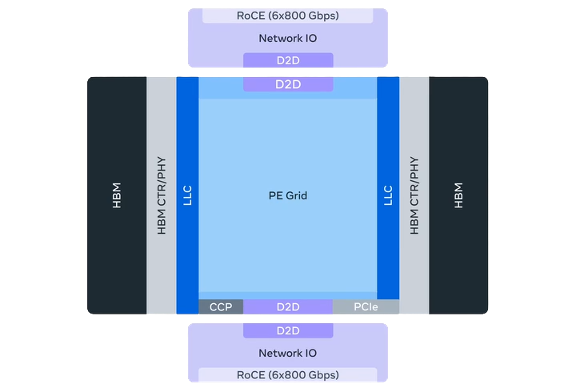
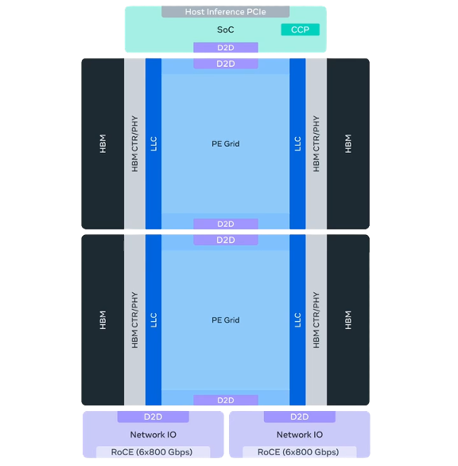
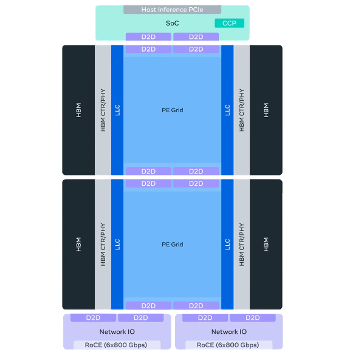
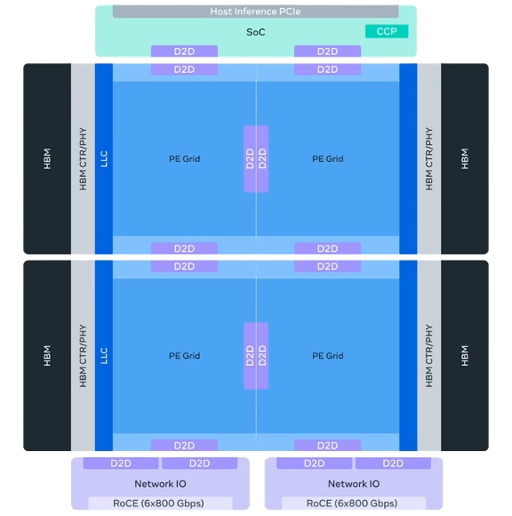

# February 2026

This is the SixRackUnits AI hardware newsletter, keeping you up to date with the latest in AI hardware, datacentre technology, and the future of compute. With a field changing this fast, staying on top of everything, or even summarising all the material available can be difficult - so I do it for you.

For a space to share sources and news/updates, join the [telegram channel](https://t.me/aihpc_infra_fans) or if you like short form posts on similar topics, check out the [notes section](https://sixrackunits.substack.com/notes) of this newsletter or my [LinkedIn](https://www.linkedin.com/in/hitesh-kumar-6ru).

**[This month's updates](#this-months-updates)**

- [**Meta's very real roadmap revealed: "Four chips in two years"**](#metas-very-real-roadmap-revealed-four-chips-in-two-years)
- [**Arista's XPO: 100s of liquid-cooled TB/s per server, very soon**](#aristas-xpo-100s-of-liquid-cooled-tbs-per-server-very-soon)
- [**NVIDIA has enemies home and away: Huawei catches up in China**](#nvidia-has-enemies-home-and-away-huawei-catches-up-in-china)
- [**Other notable headlines**](#other-notable-headlines)

---

# This month's updates

## Meta's very real roadmap revealed: "Four chips in two years"

*Source: Meta*

_Meta finally lay out a strong roadmap for at least four iterations of its internal-use MTIA inference accelerator, promising serious raw performance on paper as well as a solid understanding of what's needed for rapid and widespread adoption among their developers._

As weve seen from Intel, having a roadmap is everything. and Meta isnt even going to sell MTIA public anyway.

It's more than just a trend now for everyone to design their own custom hardware. If you have the money, people, and consistent internal demand for specific workloads, why not? As we've seen in the past though (Intel), roadmaps can be fragile and are not a commitment. Meta's situation is different fortunately, since they have:

- Extensive experience deploying AI-focused clusters reliably, at scale, customising deployments to their benefit
- Two generations of MTIA already proven with a silicon-to-rack supply chain established
- No pressure to make hardware for external users, plenty of internal demand to saturate what they build

Proof of their wisdom is that all the future MTIA generations they've annouced will be designed to sit in the same chassis and racks, so they can easily upgrade existing deployments rather than having to build new racks and power/cooling architectures each time. This will make it easier for them to stick to their promised 6-month cadence, outpacing every hyperscaler and most merchant silicon vendors too.

*Source: Meta*

Meta are very clear that MTIA will not replace their GPU fleet - training workloads still need NVIDIA hardware to be run effectively, and undoubtedly some inference will still be done across the many generations of GPUs that Meta operate efficiently. But unlike many in the custom silicon game, they aren't pushing to support training or branching their roadmap into workload-specific lanes. Instead, from MTIA 450 onwards, Meta are pushing for supporting modern LLM inference efficiently first, and then optimising for their own ranking/recommender models later.

The hardware looks great so far, but we've seen many times that the robustness and capability of the software can completely define the future of an accelerator too. Here, Meta are arguably one of the best positioned in the industry as founders of the Pytorch foundation and now among the worlds largest users of vLLM and Triton. In addition, they've written extensively on their own networking and observability stacks (FBOSS, NCCLX, Dynolog etc.) and how they can optimise both NVIDIA and their own hardware for their use cases.

I'm quite interested to see how this roadmap gets realised over the coming months. It's easy to be hopeful about Meta.

Finally, the specs we know so far:

*Source: Meta*

- MTIA 300
  - In production now, already deployed at meaningful scale for Meta's own workloads
  - 1 compute, 2 network chiplets
  - ~1.2 PFLOPS FP8, 216GB HBM @ 6.1 TB/s, 800W TDP
  - 1TB/s scale-up unidirectional, 1.6T scale-out
  - **16-device scale-up domain, possibly within a single server, likely between a few servers**

*Source: Meta*

- MTIA 400
  - Deployment underway, framed as genuinely performance-competitive
  - 2 compute, 2 network, 1 SoC chiplets
  - ~6 PFLOPS FP8, 288GB HBM @ 9.2 TB/s, 1200W TDP.
  - 1.2TB/s scale-up unidirectional, 800G scale-out
  - **72-device scale-up domain, in one rack, switched backplace**

*Source: Meta*

- MTIA 450
  - Due early 2027, tuned directly for LLM inference
  - 2 compute, 2 network, 1 SoC chiplets
  - ~7 PFLOPS FP8, 288GB HBM @ 18.4 TB/s, 1400W TDP
  - 1.2TB/s scale-up unidirectional, 800G scale-out
  - **Doubling die-to-die interconnects from MTIA 400**

*Source: Meta*

- MTIA 500
  - Due late 2027, the most modular and most ambitious
  - 4 compute, 2 network, 1 SoC chiplets
  - ~10 PFLOPS FP8, 384-512GB HBM, 1700W TDP
  - 1.2TB/s scale-up unidirectional, 800G scale-out
  - **2x2 compute chiplet arrangement**

## Arista's XPO: 100s of liquid-cooled TB/s per server, very soon

- Arista is not just launching another optics module here, but proposing a new pluggable form factor for AI-era networking: XPO, or eXtra-dense Pluggable Optics.
- The headline spec is 12.8 Tbps per module, using 64 channels at 200G each.
- Front panel density reaches 204.8 Tbps per OCP rack unit, which Arista frames as 4x denser than 1600G OSFP.
- Arista also describes XPO as an 8x increase in module density versus OSFP, because one XPO module effectively replaces eight OSFP modules.
- The whole concept is "liquid-first." XPO builds the cold plate into the module instead of treating liquid cooling as an add-on.
- The exploded module diagrams make this physically clear: one pluggable shell contains two paddle cards with a shared cold plate in between.
- That matters because air-cooled pluggables and flat-top OSFP modules are running into their thermal limits as AI fabrics get denser.
- Arista claims XPO can cool modules up to 400W, which is enough to support high-power optics like 8x1600G ZR and ZR+.
- Smart framing: the optics are now becoming infrastructure-class thermal devices, not just networking accessories.
- Internally, XPO uses two 32-channel paddle cards in a belly-to-belly arrangement sharing one integrated cold plate.
- The diagrams also show a dedicated `48V & comm card`, reinforcing that XPO is rethinking power delivery and control at the module level too.
- Arista says the controlled liquid temperatures keep component temperatures 20-25C lower than air-cooled optics, which should improve lifetime and lower failure rates.
- Reliability is one of the more underrated points in this announcement. Arista says each 32-channel paddle card only needs one microcontroller and one set of voltage converters.
- Compared with eight equivalent OSFP modules, that cuts those support components by roughly 75%, which should materially reduce failure count in huge clusters.
- XPO also moves voltage conversion from the motherboard into the module, reducing motherboard complexity and further helping reliability and serviceability.
- Arista's larger point is that AI clusters are becoming so optics-heavy that transceiver reliability is now a cluster-level design problem.
- The density argument is even more important than the optics spec itself. Arista says XPO cuts required switch racks by 75% versus OSFP in large AI deployments.
- Their example is a 400 MW AI datacenter with 128,000 XPUs in 1,024 XPU racks, each XPU needing 12.8 Tbps scale-up and 1.6 Tbps scale-out bandwidth.
- Using 1600G OSFP switches at 1,024 ports per rack, Arista says that design would need more than 1,400 switch racks.
- With XPO, the switch rack count drops to 352, saving over 1,050 switch racks.
- Arista then makes the aggressive claim that the same AI datacenter could be built in roughly half the size.
- Even if that is optimistic, the broader point is probably right: networking footprint is becoming absurdly large in AI factories, and optics density is now a datacenter construction issue.
- The rack comparison image makes the marketing claim more tangible: one example goes from eight OSFP switch racks to two XPO switch racks.
- This is one of the few optics announcements that directly links transceiver form factor to bus bars, plumbing, power shelves, floor space, and deployment time.
- So XPO is really a datacenter capex and buildout thesis disguised as an optics module announcement.
- Another important point: Arista is defending pluggables, not abandoning them for co-packaged optics.
- XPO is effectively Arista's answer to "what if CPO is right about density and thermals, but operators still want pluggable serviceability and a disaggregated optics ecosystem?"
- That makes XPO strategically interesting. It is not anti-CPO, but it clearly tries to preserve the pluggable supply chain before optics gets pulled on-package.
- Arista explicitly says XPO preserves manufacturability, configurability, serviceability, and the disaggregated business model of pluggable optics.
- The universality claim is also central. Arista says XPO supports DR, FR, LR, SR, ZR, ZR+, copper, coherent-lite, slow-and-wide, and RF-microwave approaches.
- It also supports linear, half-retimed, and fully retimed architectures, meaning Arista is trying to make XPO the neutral container for almost every optical camp.
- That is clever because the optical industry still has not settled on one "winning" architecture for AI scale-up and inter-cluster links.
- Arista says the XPO paddle card area is nearly the same as eight OSFP modules, which means module vendors can reuse existing silicon and photonics technology rather than waiting for new optical engines.
- That may be the real reason XPO matters now rather than later: it promises a big packaging and density jump without requiring a full photonics reset.
- TeraHop's PR is useful here because it claims the industry's first live demonstration of a 12.8T XPO module at OFC 2026, specifically an XPO-8xDR8 transceiver.
- That suggests XPO is not just a paper MSA. At least some vendors already have demonstrable hardware.
- Arista says the XPO MSA launched with over 45 founding members. TeraHop calls itself a founding member as well.
- The breadth of membership matters because new optical form factors die quickly without broad ecosystem backing.
- Microsoft publicly endorsed the MSA, saying it could help establish a broadly adopted form factor with a diverse optical ecosystem.
- Dell'Oro also endorsed it, which is notable because analysts usually do not hand out that kind of validation unless supplier support is real.
- Futuriom says the new pluggable is due in 2027, so the near-term story is ecosystem formation and demos, not immediate hyperscale deployment.
- That timing makes sense. The specification is arriving just as AI clusters are running into the physical limits of today's optics density and cooling models.
- Arista also ties XPO into power efficiency in three ways: cleaner linear electrical channels, support for lower-power photonics technologies, and direct use of the 50VDC bus bar voltage.
- The 50VDC point is subtle but important because it aligns the optics module with the same liquid-cooled, high-current power architecture trends already reshaping AI racks.
- The WeChat analysis adds a useful supply-chain angle: one estimate puts the cold plate at roughly 15% of total XPO module value.
- If that is even directionally correct, XPO is not just an optics story but also a meaningful liquid-cooling component story.
- The same writeup says some XPO cold plates are still only at sample stage, with 3D-printed flow-channel designs being explored for more complex internal thermal paths.
- Another smart inference: once optics can take 400W per module and still stay serviceable, the boundary between "transceiver" and "line card subsystem" starts to blur.
- The blog also points out that OSFP will still remain the highest-volume optics module for the foreseeable future, so XPO is not a total replacement.
- Instead, XPO looks like a specialised form factor for the most extreme AI datacenters, where front-panel density and liquid cooling dominate every design decision.
- This is why Arista keeps talking about scale-up, scale-out, scale-across, and even metro reach in one breath: XPO is being pitched as the optics form factor for the whole AI fabric stack.
- The subtext is that AI networking is pulling optics out of traditional switching constraints and closer to the design logic of XPUs and rack infrastructure.
- If Arista is right, future AI datacenters may be limited less by switch ASIC throughput than by how neatly optics can be cooled, packed, powered, and serviced.
- The real competitive question is whether XPO becomes the "OSFP for liquid-cooled AI networking," or whether CPO and optical engines outrun pluggables before XPO reaches volume.
- My own take: this is one of the more serious attempts to keep pluggables alive in an environment that increasingly wants on-board or near-package optics.
- In other words, XPO may be less about winning the next optics generation outright and more about buying the pluggable ecosystem another very valuable cycle.

## NVIDIA has enemies home and away: Huawei catches up in China

- This story is less "Huawei finally matched NVIDIA in raw silicon" and more "Huawei finally attacked NVIDIA's real moat: CUDA lock-in."
- CANN Next appears to be the key change. Huawei has added a CUDA-like SIMT programming model with thread blocks, warps, and kernel launches.
- Important nuance: this does not look like a simple translation layer. Huawei seems to be treating CUDA as the de facto programming standard, then mapping those abstractions natively onto Ascend.
- Reuters, echoed by WCCF, says Chinese customers are happier with the 950PR because it is more CUDA-compatible and has better response speeds. That sounds like the actual adoption trigger.
- Reportedly, ByteDance and Alibaba are preparing orders for the 950PR. If true, this implies migration friction has fallen enough for hyperscalers to seriously commit.
- So Huawei may be winning customers by reducing software pain rather than by leapfrogging NVIDIA on die-level performance.
- The 950 series is already split by workload. 950PR is for prefill and recommendation-heavy inference, while 950DT comes later for decode and training-oriented tasks.
- Smart inference: Huawei is following the same prefill/decode disaggregation trend the wider AI infrastructure market is moving toward, rather than chasing one universal chip.
- Huawei roadmaped the 950PR for 1Q26, 950DT for 4Q26, 960 for 4Q27, and 970 for 4Q28. March 2026 is therefore Huawei cashing a roadmap promise, not just teasing slides.
- One reason the coverage got messy: Reuters appears to describe a 950PR family with both DDR and HBM variants, but multiple China watchers think this is partly mixing PR and DT.
- Huawei Connect 2025 said 950PR would use 128 GB of self-developed HiBL 1.0 HBM at 1.6 TB/s. Atlas 350 launch coverage now says 112 GB and 1.4 TB/s.
- That discrepancy is worth noting. It could mean yield-binning, SKU segmentation, reserved memory, or that the shipping Atlas 350 card is a cut-down implementation of the full 950PR target.
- Another plausible explanation is that Reuters described two commercial variants of a prefill product stack: a cheaper DDR card and a premium HBM card, while roadmap slides describe the chip family more broadly.
- The safest conclusion is not "Reuters is wrong" but "Huawei's shipping SKU stack is broader and murkier than the public roadmap tables suggest."
- Atlas 350 is the first shipping card built around the 950PR, launched at Huawei China Partner Conference 2026 in Shenzhen.
- This looks more commercialised than some English reporting implied. At launch, Huawei showed seven hardware partners already shipping Atlas 350 based systems.
- That matters because it suggests the product was already in ecosystem rollout mode, not waiting for a distant 2H26 volume event.
- Huawei claims Atlas 350 delivers 1.56 PFLOPS of FP4, around 2.87x the H20. That comparison is imperfect because Hopper did not natively center FP4 the way Blackwell and now Huawei do.
- Separate coverage and roadmap slides also put the 950PR around 1 PFLOPS FP8 and 2 PFLOPS FP4, suggesting Huawei is heavily optimising around low-precision inference economics.
- Huawei says Atlas 350 is the only domestic Chinese inference product with FP4 support right now. That matters because FP4 is becoming the preferred way to stretch model size and cut cost/token.
- Huawei claims multimodal generation speed is up 60%, memory access granularity drops from 512B to 128B, and small-operator memory efficiency improves 4x.
- Huawei also claims doubled vector compute and 2.5x better recommendation performance, implying the chip is being tuned for practical online services, not just flashy LLM demos.
- Atlas 350 / 950PR exposes 2 TB/s of interconnect bandwidth through LingQu / UnifiedBus, around 2.5x above the 910 generation.
- Huawei says Atlas 350 cards can be used standalone or pooled in groups of four through UnifiedBus, meaning it can flex between large-model capacity pooling and lower-latency deployments.
- Atlas 350 is rated at 600W versus H20 at 400W. So even if Huawei wins on some low-precision metrics, power efficiency is not obviously where the advantage lies.
- Reported pricing is roughly RMB 111,000, or around $16,000. That suggests Huawei is not necessarily undercutting NVIDIA dramatically; availability, compatibility, and policy alignment may matter more than price.
- A separate Reuters screenshot cited RMB 50,000 for a DDR version and RMB 70,000 for an HBM version. If real, that creates a meaningful two-tier inference product strategy.
- Smart inference: a DDR version would make sense for cost-sensitive chatbot or batch inference, while an HBM version serves higher-throughput prefill and multimodal demand.
- Huawei is clearly building a full domestic stack: Ascend silicon, self-built HBM, UnifiedBus interconnect, Atlas cards and servers, CloudMatrix / Atlas SuperPoD systems, CANN, MindIE, and open-source integrations.
- This matches Huawei's older CloudMatrix 384 strategy: accept weaker per-chip silicon, then compensate with more system engineering, more optics, and more scale.
- CloudMatrix 384 already showed this pattern with 384 Ascend 910C chips, roughly 5,400 400G transceivers, and a massive 560-600 kW system draw just to compete at the system level with NVL72.
- Huawei therefore does not need Ascend to beat NVIDIA chip-for-chip if it can win cluster-for-cluster inside China.
- Huawei has said CloudMatrix 384 deployments have exceeded 300 units across more than 20 customers. If true, that is enough installed base to start creating ecosystem gravity by itself.
- Atlas 950 SuperPoD made its first global appearance at MWC Barcelona 2026. Huawei says it can scale to 8,192 NPUs, with 64 NPUs per cabinet, all linked as one computer through UnifiedBus.
- An independent topology writeup based on Huawei's public data models Atlas 950 as 128 compute cabinets plus 32 bus cabinets, arranged in eight groups.
- That same analysis assumes 64 cards per cabinet, 16 compute cabinets plus 4 bus cabinets per group, and second-half 2026 timing.
- In the 384-node generation, Huawei reportedly used 3,168 optical fibres. Extrapolations for the 8,192-node system imply an enormous optics footprint even without a literal all-to-all fabric.
- Important systems point: Huawei's "all-optical" marketing should probably be read as "optics everywhere it matters," not a naïve fully connected graph.
- Huawei is also pushing UBoE, effectively UnifiedBus over Ethernet, as a way to reduce switch and optics count versus RoCE while keeping customers inside an Ethernet-centric operating model.
- That is a clever positioning move: Huawei is not just offering "a Chinese GPU," but a domestic alternative to CUDA, NVLink/NVSwitch, rack-scale systems, and even the surrounding network architecture.
- The software opening has been building for a while. In 2025 Huawei moved to open-source key Ascend stack components including CANN, GE, Ascend C, and MindIE.
- Huawei also says CANN now supports or works with PyTorch, vLLM, SGLang, xLLM, verl, Triton, and TileLang. Whether that support is deep enough in practice is a separate question, but the direction is obvious.
- The March CANN slides are arguably even more important than the chip slides. Huawei is not just exposing APIs, it is showing an actual developer workflow around Ascend C.
- The tooling shown includes a VS Code plugin, MindStudio Insight, `msDebug`, `msSanitizer`, `msProf`, and operator engineering tools around `msopgen/msopst`.
- That matters because a CUDA competitor needs debuggers, sanitizers, profilers, visualisation, and build tooling, not just kernels and marketing.
- Huawei is also explicitly supporting heterogeneous compilation and direct `<<<>>>` style invocation semantics, which is about reducing mental friction for CUDA-trained developers.
- The slides describe the next-generation Ascend C model as mixed `SIMD/SIMT`, not one replacing the other. That suggests Huawei wants vector efficiency and GPU-like programmability at the same time.
- The hardware slides also call out Cube-Vector fused paths, register-based upgrades, efficient DMA / ND-DMA style data movement, and a 128B sector cache.
- That combination suggests Huawei is tuning the architecture around lower precision kernels and memory movement efficiency, exactly where inference economics are won.
- Slide decks also show Ascend 950 moving from a previous 2-die arrangement to a 4-die split, separating compute and IO.
- More specifically, the 950 appears to use two compute dies plus two IO dies, with the IO side weakly tied to process scaling and therefore easier to evolve independently.
- That is a smart packaging move under sanctions: separate the expensive compute problem from the connectivity problem, and preserve yield where possible.
- One slide shows each IO die with 36 lanes divided into nine ports, support for x4 UB, x4 UBoE, and x16 PCIe device connectivity.
- Huawei also highlights a dedicated collective communication unit, CCU 1.0, inside the IO die. That is another sign they are optimising for cluster communication as a first-class hardware function.
- The architecture slide explicitly presents a unified 950 chip interface with different memory pairings: HiBL 1.0 for lower-cost PR products and HiZQ 2.0 for higher-bandwidth DT products.
- This strengthens the interpretation that 950PR and 950DT are not radically different chips, but memory- and workload-specialised products built on a common base platform.
- Smart inference: Huawei has effectively admitted the market will not learn a brand-new programming model. Compatibility beats elegance, so "CUDA-like" is the fastest path to adoption.
- Another inference: 950PR looks much more like an H20 replacement than a B200 replacement. That is logical, because export controls created a huge China-only market gap exactly in that performance class.
- Another inference: Huawei is doing the sensible thing for a constrained domestic supply chain by pushing the easier memory and packaging problem first, then the harder one later.
- If HiBL 1.0 is lower-cost and lower-bandwidth than HiZQ 2.0, Huawei can prioritise a larger volume inference chip before attempting the higher-bandwidth decode/training product.
- That would also explain why some observers argue 4-layer or lower-end memory stacks are enough for a large share of current inference workloads, especially compared with training.
- Another inference: Huawei is trying to own the inference-heavy domestic deployment layer first, then move upward through DT / SuperPoD products toward larger training and mixed workloads.
- Export controls and Chinese policy are doing real work here. Domestic chips are increasingly preferred in state-linked procurement, while importing NVIDIA parts into China is slow, political, and operationally messy.
- This means Huawei's momentum is not explained by the chip alone. It is the combination of sanctions, domestic policy, a more open software stack, and deep system integration.
- There are conflicting volume numbers in circulation. Some reporting points to 750,000 950PR chips, while other investor-style sources imply well over one million Ascend-family shipments in 2026.
- That discrepancy probably means channel chatter is mixing chip-level forecasts, family-level forecasts, and perhaps card shipments versus die shipments.
- Some commentators are dismissing the 750,000 number outright because Reuters has repeatedly revised Huawei production figures upward and because launch evidence suggests deployment has already started.
- At the same time, the strongest bearish counterargument is that even 750,000 units is tiny relative to U.S. and partner output, especially once adjusted for chip quality and per-chip performance.
- That critique is directionally fair for global compute supply, but it misses the more relevant question: whether Huawei can satisfy enough domestic Chinese demand to become the default local option.
- A weaker but still interesting rumor in Chinese investor coverage is that DeepSeek V4 is prioritising adaptation to domestic compute. If true, Huawei could benefit from model-side optimisation rather than just customer-side substitution.
- Another smart framing from your added notes: the current boom is in inference, not frontier training. OpenClaw / agent demand means Huawei only needs to be "good enough" where the demand curve is steepest.
- Risks and counterpoints: raw per-chip performance still trails NVIDIA, power looks high, advanced packaging is still constrained by sanctions, and some Chinese demand will continue flowing to grey-market or offshore NVIDIA.
- Also, even if CANN Next feels more like CUDA now, Huawei still has to prove profiler quality, compiler stability, debugging tooling, library depth, and real-world repo compatibility at scale.
- Another risk: public reporting is still mixing card specs, chip specs, roadmap specs, and cluster specs. Any article here should be explicit about which layer each claim belongs to.
- The big article question is whether Huawei has crossed the line from "usable domestic substitute" to "default Chinese deployment target." That is the real significance of this 950PR story.

---

## Other notable headlines

[[1]](https://www.servethehome.com/broadcom-launches-taurus-bcm83640-a-3nm-400g-per-lane-optical-dsp/): Broadcom launches 400G DSPs, laying groundwork for 3.2T optics and eventually 204.8T switch fabrics.

[[2]](https://www.linkedin.com/pulse/finally-network-silicon-thinks-itself-chris-grundemann-gsk1f/): XSight unveils a programmable 12.8T switch and 800G DPU, competing on architecture rather than just port counts.

[[3]](https://www.tomshardware.com/tech-industry/semiconductors/isscc-2026-rebellions-ucie-rebel-100): Rebellions details its UCIe based Rebel100 chiplet design, one of the more serious modular accelerator efforts so far.

[[4]](https://videocardz.com/newz/nvidia-reportedly-plans-geforce-rtx-5050-with-9gb-memory-and-96-bit-bus): NVIDIA reportedly plans a 9GB RTX 5050, using 3GB GDDR7 dies to dress up the low end.

[[5]](https://www.tomshardware.com/tech-industry/optical-transceiver-achieves-up-to-25-gbps-throughput-with-ultra-low-latency-and-10km-range-taara-beam-uses-silicon-photonics-technology-device-about-as-big-as-a-shoebox): Taara's shoebox sized optical link reaches 25Gbps over distance, keeping the dream of fibre without fibre alive.

[[6]](https://wccftech.com/micron-ships-out-the-worlds-first-256gb-socamm2-modules/): Micron starts sampling 256GB SOCAMM2, pushing LPDDR further into AI server memory territory.

[[7]](https://www.guru3d.com/story/rambus-ships-hbm4e-controller-ip-rated-for-16-gbps-per-pin/): Rambus launches HBM4E controller IP at 16Gbps per pin, because memory bandwidth targets are no longer pretending.

[[8]](https://www.trendforce.com/news/2026/03/06/news-industry-weigh-825-900-%ce%bcm-hbm-thickness-for-20-high-stacks-potentially-slowing-hybrid-bonding/): HBM vendors are weighing thicker 20 high stacks, another reminder that packaging physics still sets the pace.

[[9]](https://www.reuters.com/world/china/nvidia-preparing-groq-chips-that-can-be-sold-chinese-market-sources-say-2026-03-17/): NVIDIA is reportedly preparing China compliant inference chips, because restrictions just push the competition further downstream.

[[10]](https://wccftech.com/apples-baltra-asic-cant-come-soon-enough-as-the-vast-majority-of-its-current-ai-servers-are-reportedly-rotting-on-the-shelves/): Apple reportedly has most of its AI servers sitting idle, which is not what strategic urgency looks like.

[[11]](https://www.nextplatform.com/compute/2026/02/23/amd-says-helios-racks-and-mi400-series-gpus-on-track-for-2h-2026/4092199): AMD says Helios and MI400 remain on track, though only shipped systems will settle that argument.

[[12]](https://www.nextplatform.com/compute/2025/10/14/oracle-first-in-line-for-amd-altair-mi450-gpus-helios-racks/1632443): Oracle is reportedly first for AMD's MI450 Helios racks, a major chance for AMD to prove rackscale credibility.

[[13]](https://xpu-news.hn.plus/item/178347/aws-and-cerebras-team-up-on-ai-inference): AWS and Cerebras are splitting inference between prefill and decode, showing hyperscalers will mix silicon when latency matters.

[[14]](https://www.trendforce.com/news/2026/03/04/news-socamm-war-heats-up-micron-ships-256gb-socamm2-samples-topping-industry-capacity/): TrendForce says Micron now leads SOCAMM2 capacity, turning LPDDR into another front in the AI memory war.

[[15]](https://www.tomshardware.com/pc-components/gpus/lisuan-updates-lx-professional-gpu-product-page-with-server-and-workstation-specs): Lisuan expands LX server and workstation specs, and China's domestic GPU stack keeps looking increasingly serious.

[[16]](https://www.techspot.com/news/111547-rewritable-hard-drive-made-dna-researchers-possible.html): Rewritable DNA storage remains fascinating research, but fortunately for SSD vendors, it is still nowhere near practical.

[[17]](https://www.guru3d.com/story/nvidia-dgx-station-gb300-superchip-specifications-and-748gb-unified-memory/): NVIDIA's DGX Station GB300 is absurdly powerful for a desk, which is exactly why people will want one.

[[18]](https://www.tweaktown.com/news/110499/kioxia-announces-a-brand-new-type-of-ssd-and-its-a-game-changer-for-ai/index.html): KIOXIA is building SSDs to extend effective GPU memory, because flash is becoming the fallback for scarce HBM.

[[19]](https://www.tomshardware.com/tech-industry/artificial-intelligence/amd-broadcom-and-nvidia-join-hyperscalers-to-define-optical-scale-up-interconnect-of-the-future-for-ai-clusters-meta-microsoft-and-openai-to-benefit-as-speeds-eventually-scale-to-3-2-tb-s): AMD, Broadcom and NVIDIA are standardising optical scale up links, because copper is running out of road.

[[20]](https://www.nextplatform.com/connect/2026/03/02/nvidia-sees-the-light-on-silicon-photonics-and-maybe-optical-switching/4093099): NVIDIA is betting heavily on silicon photonics, because optics is becoming mandatory rather than exotic.

---

